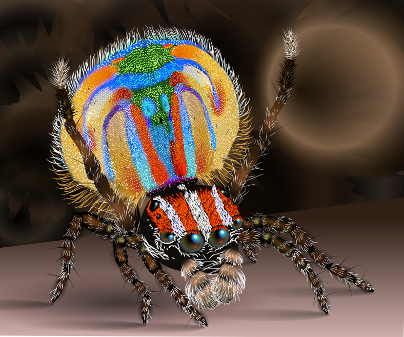

# SVGAndMe

 

SVGAndMe turns .svg files into something useful for programmers.  You can use
 the parser to turn the .svg file into a document in memory that you can then
 use in your program.  You can also use the parser, and a drawing canvas
 to turn that .svg into an image to be used in your program, or saved to a file.
 Written in C++, SVGAndMe is intended to be self contained, and cross platform.
 It is a fairly complete library, supporting most of the SVG features found in 
 typical usage today.
 

## Design Goal 
The general design goal of SVGAndMe is to support a high percentage
of SVG files found in the wild.  It is also a design goal to be as
cross platform as possible, not relying on any platform specific features, other
than the blend2d library, which is fairly portable.

It is NOT a goal to be a "complete" SVG library, as that task is nearly impossible,
and impractical for such a small library.

## Implementation 
SVGAndMe is fairly straightforward C++ code.  All the parsing is done with no 
external dependencies, leaving you with a clean SVGDocument that can be used
for multiple purposes.  Rendering is done using the blend2d graphics library 
as its implementation matches the drawing requirements of SVG.

## A bit about the blend2d library 
The blend2d library is a fast, multi-threaded 2D graphics library that was designed to be
fairly compatible with the SVG graphics features.  As such, most of the drawing features of SVG
are supported, from gradients, to shapes, to patterns, and beyond.  There are a few exceptions
in terms of missing features, but what is there supports 90% of the svg files that are
typically found in the wild.
 
While blend2d provides great support for the various raw graphics primitives, it does not
inherently support the more web focused aspects of SVG such as CSS, groupings, definitions, and the like.  
Here, svgandme fills in the blanks, having a modest amount of support for style sheets, and some more esoteric features 
of the SVG specification.

## Not supported 
- Animation  - Very runtime specific, not likely to ever be included
- Filters    - will depend on future blend2d support
- Path based clipping - will depend on future blend2d support

## Usage 
 Look into the 'testy/' directory for some example projects.  'svgimage' shows the basics of how to 
 load a .svg file, and render it into an image, which can then be saved.  That's just the basics
 and can act as a starting point for using the library.

## Extra Notes 
SVG is an XML based grammar.  SVGAndMe contains a fairly robust XML parser which is zero memory allocating, and very fast.  This XML scanner is probably good enough to tackle most typical XML processing tasks, so it might serve as a jumping off point if you have more XML than just SVG to be processed in your applications.  Look at the 'xmlpull/' example for usage details.

