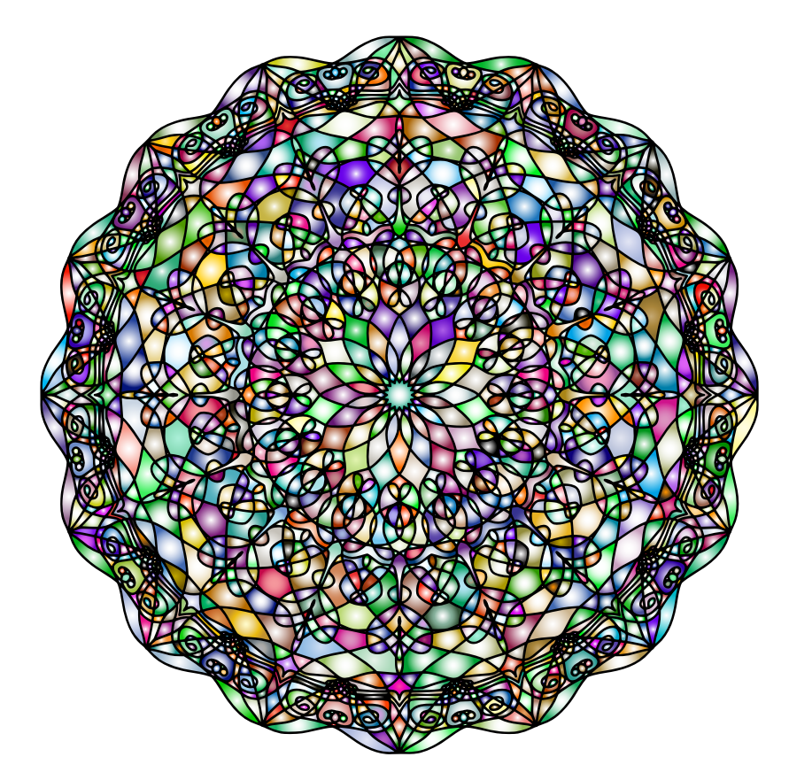
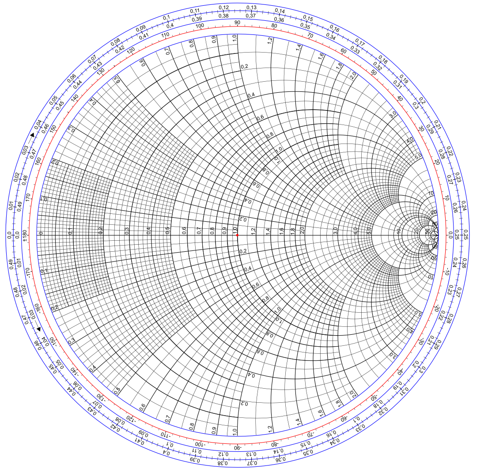

# Gallery of the amazing
 

| Masjid Al Wadood |
|-------------------------------|
|  |
| <a href="Masjid_Al_Wadood_logo.svg">Masjid_Al_Wadood_logo.svg</a>
|A fairly simple .svg image|
|path|
 

| Gradient Conical |
|-------------------------------|
|  |
| <a href="example_gradient_conical.svg">example_gradient_conical.svg</a>
|Implementation of non-standard conical gradient feature|
|gradient, path|
 

| Gradient Radial |
|-------------------------------|
|  |
| <a href="mandala.svg">mandala.svg</a>
|Heavy usage of radial gradients|
|radial gradient, path|
 

| Peacock Spider |
|-------------------------------|
|  |
| <a href="Male_peacock_spider2.svg">Male_Peacock_Spider2.svg</a>
|A fairly complicated .svg image|
|gradient, image, path|
 

| Reflex Camera |
|-------------------------------|
|  |
| <a href="Reflex_camera.svg">Reflex_camera.svg</a>
|Fairly complex. fine detail|
|path, text, gradient|
 

| Smith Chart |
|-------------------------------|
|  |
| <a href="Smith_chart.svg">Smith_chart.svg</a>
|complex text rotations, complex paths|
|path, text|
 

| Spiderman |
|-------------------------------|
|  |
| <a href="Spiderman.svg">Spiderman.svg</a>
|Using large paths|
|path|
 

